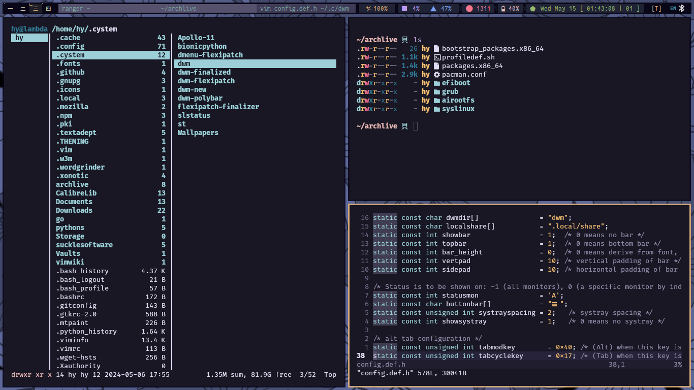

	

## Screenshot

Patches Added
-------------
* vanitygaps
* colorbar
* canfocus
* rotatestack
* IPC
* resizemove with mouse
* restartsig
* swallow
* hide vacant tags + powerline tags
* rotatetags
* autostart
* dynamicscratchpads
* barpadding
* barheight
* awesomebar
* status2d
* systray
* cfacts 
* statusbutton
* And a few layouts

Its good to have slstatus set up with dwm (included in my slstatus repo)

Requirements
------------
In order to build dwm you need the Xlib header files. 
You will also need libxft-bgra for colored emojis 

Installation
------------

	git clone https://github.com/pearcidar/dwm.git
	cd dwm

Edit config.mk to match your local setup if needed(dwm is installed into
the /usr/local namespace by default).
then run:

	sudo make clean install

dwm will search for an autostart script in .local/share/dwm/autostart.sh, create that for autostart functionality
 
Running dwm
-----------

dwm is usable with a display manager with the included *dwm.desktop* file

or:

Add the following line to your .xinitrc to start dwm using startx:

    exec dwm

In order to connect dwm to a specific display, make sure that
the DISPLAY environment variable is set correctly, e.g.:

    DISPLAY=foo.bar:1 exec dwm

(This will start dwm on display :1 of the host foo.bar.)

Slstatus will have all the needed statusbar scripts with it, use my build or other builds for that 
 
Configuration
-------------
The configuration of dwm is done by creating a custom config.h (or config.def.h for default settings)
and recompiling the source code with `sudo make install`

## Credits

Thanks to [dwm-flexipatch](https://github.com/bakkeby/dwm-flexipatch)
